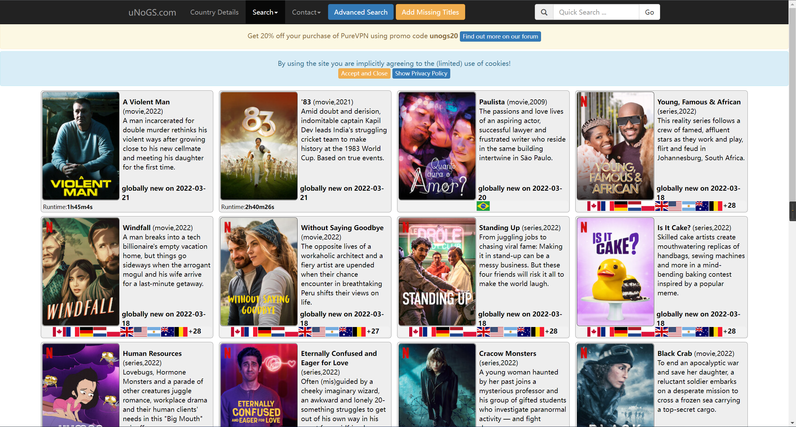

# Netflix 影片资源地区查询

### 工具介绍&#x20;

#### UNOGS 访问地址


UNOGS


网站名称就是Netflix Global Search（Netflix全球搜索），在这个网站你可以查看你想看的电影或者电视剧在Netflix上是否提供，在哪个国家提供，还可以查看最近 Netflix 发布了什么新片，以24小时或者5天或者10天为基准。

### 查询方法

以“蜘蛛侠”为例，首先查到蜘蛛侠英文名为 Spider-Man，之后在地址搜索Spider-Man，之后就可以看到蜘蛛侠全集，以及这些电影在Netflix的哪些分区提供

